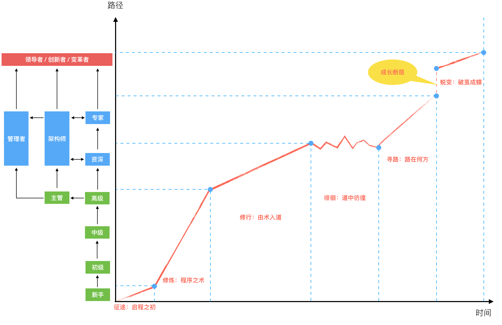

# 程序员进阶攻略

## 程序员成长路线图

## 启程

### 技术方向选择

#### 选择语言

[^2020年5月编程语言排行榜 数据来源于：https://hellogithub.com/report/tiobe/?url=/periodical/volume/]: 

美国作家纳西姆·塔勒布（《黑天鹅》《反脆弱》等书作者）曾说：

> 信息或者想法的预期寿命，和它的现有寿命成正比。

而编程语言以及由它编写的所有软件系统和程序，本质就是信息了。换句话说就是，如果你想预测一门语言还会存在多久，就看看它已经存在了多久。存活时间足够长的语言，可以预期，它未来也还可能存活这么长时间。当然这一论断并不绝对，但它更多想说明越是新的语言或技术，升级换代越快，也越容易被取代。

#### 选择回报

关于技术，有一句流行的话：“技术总是短期被高估，但长期被低估。”今天，在人工智能领域获得超额回报的顶级专家，实际数十年前在其被低估时就进入了这个领域，数十年的持续投入，才在如今迎来了人工智能的 “牛市” ，有了所谓的超额回报。所以，不妨投入到一些可能在长期被低估的基础技术上，而不是被技术潮流的短期波动所左右。

技术的选择，都是赚取长期回报，短期的波动放在长期来看终将被抵消掉，成为时代的一朵小浪花。

#### 选择行业

先想想自己想从事哪个行业的软件开发；然后，再看看：这个行业的现状如何？行业的平均增速如何？和其他行业相比如何？这个行业里最好的公司相比行业平均增速又如何？最后，再看看这些最好的公司都用些什么样的技术栈和语言。如果你想进入这样的公司，那就很简单了，就选择学这样的技术和语言。

##### 不要总是看兴趣

- 兴趣能轻松驱动你做到前 50%，但按二八原则，要进入前 20% 的高手领域，仅仅靠兴趣就不够了
- 兴趣给你的奖励是 “好玩”，但继续往前走就会遇到很多 “不好玩” 的事，这是一种前进的障碍，这时的功利主义选择，也算是给予你越过障碍所经历痛苦的补偿吧

### 关于技能

#### 两个维度

- 掌握：意味着是一开始就要求熟练掌握的硬技能，这是生存之本。而至于掌握的深度，是动态的，倒是可以在行进过程中不断去迭代加深
- 了解：相对掌握不是必需，但也需要达到知其然的程度，甚至知其所以然更好

#### 掌握

需要掌握的核心生存技能有哪些呢？

##### 开发平台

开发平台决定了你会成为什么类型和方向的程序员。比如：服务端、客户端或前端开发等。其中进一步细分客户端还可以有 Windows、Mac、iOS 和 Android 等不同的平台。

###### 编程语言

虽然C++、JS、C# 等，这些语言都可以跨多个平台，但你选的是这些语言，基本也会归属到某一类平台上。好比你选了 C++，如果你去做了客户端开发，就很少可能再去用 C++ 写服务端程序了。

选择了语言，我们不仅仅是熟悉语言自身的特性，还需要掌握支撑语言的平台库。Java 若仅从语言特性上来说，有其优点，但其瑕疵和缺陷也一直被吐槽，要是没有 JDK 强大的平台库支撑，想必也不会有今天的繁荣。

###### 平台生态

在选择了开发平台后，除了语言和平台库之外，其生态体系内主流的技术框架和解决方案也是必选的掌握内容。

##### 常用算法

有时候你可能会觉得学校教科书上学习的经典算法，在实际工作中根本就用不上。那么为什么还要学习这些经典算法？

- 算法，表达的是一个计算的动态过程，它引入了一个度量标准：时空复杂度。
- 算法，是真实业务场景的高度抽象。

##### 数据结构

数据结构通常都和算法一起出现，但算法表达的是动态特性，而数据结构表达的是一种静态的结构特性。

###### 常用数据结构

- 数组 Array
- 链表 Linked List
- 队列 Queues
- 堆栈 Stacks
- 散列 Hashes
- 集合 Sets

###### 高阶数据结构

- 树 Trees
- 图 Graphs

#### 了解

需要了解的内容比需要掌握的更广泛，但了解了这些方面会让你更高效地协作并解决问题。

##### 数据存储

如今广泛流行的数据存储系统有下面三类：

- SQL 关系型数据库（如：MySQL、Oracle）
- NoSQL 非关系型数据库（如：HBase、MongoDB）
- Cache 缓存（如：Redis、Memcached）

按了解的深度需要依次知道如下几点：

- 如何用？在什么场景下，用什么数据存储的什么特性？
- 它们是如何工作的？
- 如何优化你的使用方式？
- 它们的量化指标，并能够进行量化分析？

##### 测试方法

###### 测试驱动开发（TDD）

先思考如何对这个功能进行测试，并完成测试代码的编写，然后编写相关的代码满足这些测试用例

##### 工程规范

最基础的工程规范是代码规范，包括两个方面：

- 代码结构
- 代码风格

##### 开发流程

而为了和团队其他成员更好地协作，估计每个新加入团队的成员都需要了解团队演进形成的开发流程规范。

##### 源码管理

- svn
- git

而对源码进行管理的最基本诉求有以下三点：

- 并行：以支持多特性，多人的并行开发
- 协作：以协调多人对同一份代码的编写
- 版本：以支持不同历史的代码版本切换

#### 总结

[^红色区域相对更小而聚焦，是需要掌握的部分，要求深度；蓝色区域的部分更广而泛，需要广度。]: 

## 程序之术

### 架构与实现

#### 定义

- 架构：软件系统的结构与行为设计
- 实现：围绕这种已定义的宏观结构去开发程序的过程

#### 做什么

架构存在与不同的维度和层次上：

- 高维度：指系统、子系统或服务之间的切分与交互结构。
- 中维度：指系统、服务内部模块的切分与交互结构。
- 低维度：指模块组成的代码结构、数据结构、库表结构等。

工作的共同点包括下面 4 个方面：

- 确定边界：划定问题域、系统域的边界。
- 切分协作：切分系统和服务，目的是建立分工与协作，并行以获得效率。
- 连接交互：在切分的各部分之间建立连接交互的原则和机制。
- 组装整合：把切分的各部分按预期定义的规则和方法组装整合为一体，完成系统目标。

##### 架构

架构师的交付成果是一整套决策流，文档仅仅是交付载体

##### 实现

实现最终交付物是程序代码

一般会有下面 6 个方面的考虑：选型评估；程序设计；执行效率；稳定健壮；维护运维；集成部署

实现一个功能，可能全部自己徒手做，也可能选择一些合适的库或框架，再从中找到需要的 API。

确定了合适的选型后，需要从逻辑、控制与数据这三个方面进一步考虑程序设计：

- 逻辑，即功能的业务逻辑，反映了真实业务场景流程与分支，包含大量业务领域知识。
- 控制，即考虑业务逻辑的执行策略，哪些可以并行执行，哪些可以异步执行，哪些地方又必须同步等待结果并串行执行？
- 数据，包括数据结构、数据状态变化和存取方式。

###### 计算机体系结构

此处让我想到了冯诺依曼计算机体系结构：

- 逻辑，对应了运算器
- 控制，对应了控制器
- 数据，对应了存储器

冯诺依曼的计算机体系不仅定义了硬件电路的边界，很多软件上面的划分也与之有异曲同工之妙。

###### 性能指标

- 响应时间：指某个请求从发出到接收到响应消耗的时间。  
- 吞吐量：指系统在单位时间内可以处理的请求数量，通常使用每秒的请求数来衡量。  
- 并发用户量：指系统能同时处理的并发用户请求数量。  

###### 实现前的考虑

进一步要考虑代码的执行效率，需要运行多长时间？要求的最大等待响应时间能否满足？并发吞吐能力如何？运行的稳定性和各种边界条件、异常处理是否考虑到了？上线后，出现 Bug，相关的监控、日志能否帮助快速定位？是否有动态线上配置和变更能力，可以快速修复一些问题？新上线版本时，你的程序是否考虑了兼容老版本的问题等？

###### 交付形态

你开发的代码是以什么形态交付？如果是提供一个程序库，则需要考虑相关的依赖复杂度和使用便利性，以及未来的升级管理。如果是提供服务，就需要考虑服务调用的管理、服务使用的统计监控，以及相关的 SLA 服务保障承诺。

#### 关注点

如果只能是一个点，我想有一个很适合的字可以表达： 熵。

系统只要是活跃的，“熵”值就会在生命周期中不断波动。需求的增加和改变，就是在不断增加“熵”值（系统的混乱程度）。但软件系统的“熵”有个临界值，当达到并超过临界值后，软件系统的生命也基本到头了。这时，你可能将迫不得已采取一种行动：重写或对系统做架构升级。

#### 断裂带

架构与实现之间，存在一条鸿沟，这是它们之间的断裂带。

##### 原因

而让架构与实现分道扬镳的原因有：

- 沟通问题：如信息传递障碍。
- 水平问题：如技术能力不足。
- 态度问题：如偷懒走捷径。
- 现实问题：如无法变更的截止日期（Deadline）。

##### 沟通与信息传递

断裂带出现在架构执行过程之中，落在文档上的架构决策实际上是静态的，但真正的架构执行过程却是动态的。架构师如何准确地传递架构决策？而开发实施的效果又如何能与架构决策保持一致？在这个过程中出现实施与决策的冲突，就又需要重新协调沟通讨论以取得新的一致。

### 模式与框架

#### 设计模式